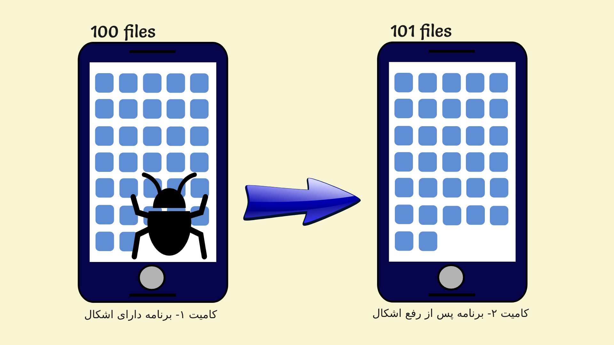
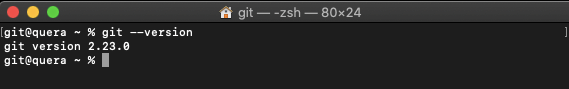
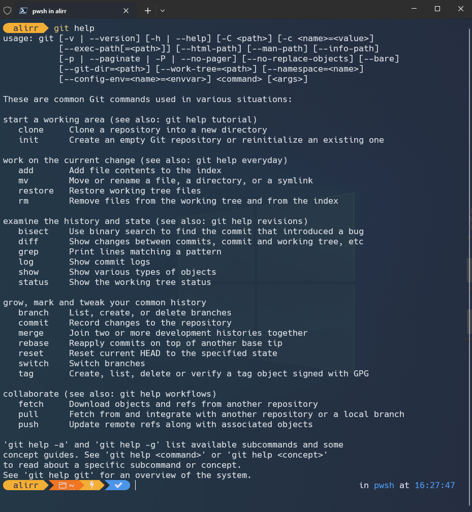
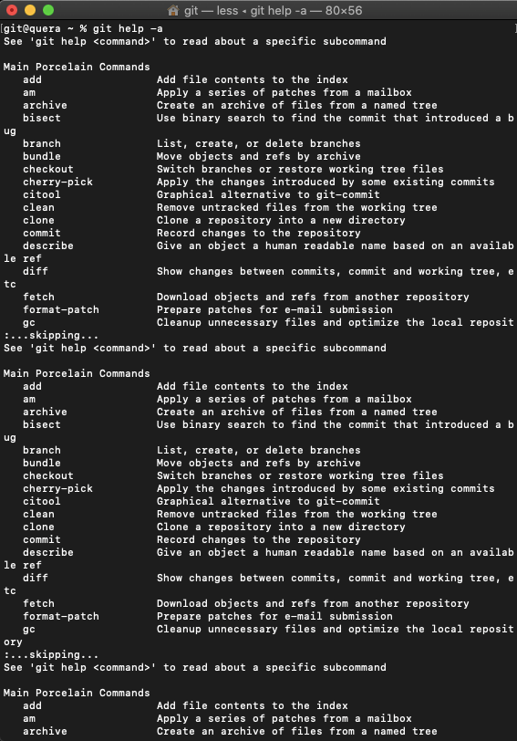
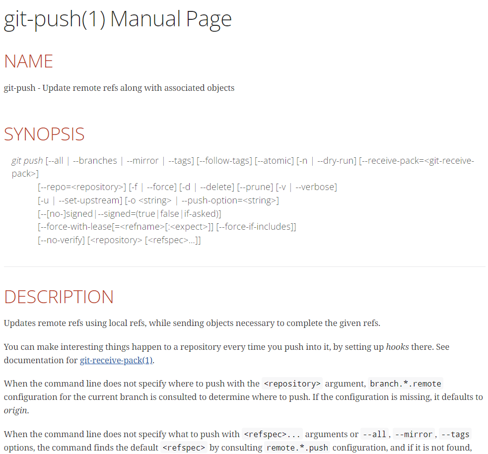
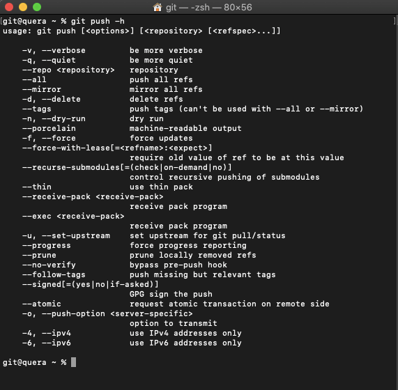

<div dir="rtl" align='justify'>

# Git & Github

## فهرست

* [چرا گیت؟](#چرا-گیت؟)
* [نصب گیت](#نصب-گیت)
* [سینتکس گیت و دستور help](#سینتکس-گیت-و-دستور-help)

## چرا گیت؟


امروزه یکی از ویژگی‌های مهم پیشبرد پروژه‌های کامپیوتری، بهبود مستمر است. بهبود مستمر یعنی افزودن ویژگی‌ها(features) و رفع اشکال‌های(bugs) برنامه در بهبود‌های کوچک به کد اصلی اضافه شود. حال به این فکر کنید که چگونه می‌توانید یک پروژه‌ی کامپیوتری را که تعداد زیادی برنامه‌نویس روی آن کار می‌کنند، مدیریت کنید؟
فرض کنید به همراه دوستتان قصد دارید یک پرو‌ژه‌ی ساده بزنید. ابتدا شما فایل‌های اولیه پروژه را روی سیستم‌تان ایجاد می‌کنید. چگونه می‌خواهید این پروژه را به دوستتان بدهید؟ شاید جواب شما انتقال فایل‌ها از طریق یک فلش باشد! ولی پس از این انتقال، شما روی سیستم خودتان و دوستتان روی سیستم خودش یک نسخه متفاوت از پروژه را پیش می‌برید. به وضوح اشکال‌های زیادی در این نحوه‌ پیشبرد پروژه وجود دارد. نه تنها شما نمی‌توانید از بخش‌هایی که فرد دیگر زده استفاده کنید، بلکه فرآیند به هم چسباندن این دو پروژه کاری بسیار سخت خواهد بود. (مخصوصا اگر روی فایل‌های یکسانی کار کنید)
حال شاید این راه به فکرتان برسد که هرکس روی یک بخش از پروژه کار کند و پس از تمام شدن کارش، کل پروژه روی فلش به فرد دیگر منتقل شود. ولی این کار به شدت سرعت پیشرفت کار را گرفته و معنای کار گروهی را زیر سوال می‌برد!
مشکلات فراوان دیگری در این نوع راه‌حل‌ها وجود دارد. مثلا اگر چند روز پیش چند تغییر در فایل‌های پروژه ایجاد کرده باشید و امروز متوجه شده باشید کار شما اشتباه بوده است، هیچ راه ساده‌ای برای جبران این اشتباه وجود ندارد و باید هر فایل را باز کرده و تغییرات را (اگر یادتان باشد!) برگردانید. بهترین راهی که به فکر می‌رسد آن است که پروژه روی یک سرور قرار بگیرد. بدین ترتیب شما و دوستتان می‌توانید پروژه را کم‌کم پیش ببرید. اما باز هم مشکلات بالا تا حد زیادی وجود دارند و باید به دنبال راه حلی برای کنترل پیشرفت پروژه بود.
برای حل این مشکلات سیستم‌های کنترل نسخه (VCS: Version Control Systems) پدید آمدند. این سیستم‌ها با نگه‌داری نسخه‌هایی از تاریخچه‌ی پروژه، به مدیریت آن کمک می‌کنند. گیت یکی از بهترین سیستم‌های کنترل نسخه است.
در گیت هر کسی روی سیستم خود یک نسخه از پروژه را دارد و یک نسخه هم روی یک سرور راه دور (remote) گذاشته می‌شود. هر کسی تغییرات مورد نظرش را روی سیستم خودش اعمال کرده و در نهایت آن‌ها را روی سرور اعمال می‌کند. همچنین هرگاه نیاز داشته باشد می‌تواند از سرور نسخه‌ی جدید را دریافت کند تا تغییرات دیگران را روی سیستم خودش داشته باشد. گیت در عین سادگی، امکانات و ویژگی‌های بسیار پیشرفته‌ای دارد. تمام مشکلات مطرح شده در بالا و بسیاری نیازمندی‌های دیگر توسط گیت کاملا برطرف می‌شوند.
گیت نسخه‌های مختلفی از پروژه را ایجاد می‌کند. هر نسخه از پروژه را یک کامیت (commit) می‌نامیم. به طور مثال در شکل زیر برنامه در کامیت ۱ دارای اشکال است و در کامیت ۲ این اشکال برطرف شده است. باید بدانیم که کامیت موجودی تغییرناپذیر (immutable) است. یعنی هر نسخه‌ای از پروژه که ایجاد می‌شود به هیچ وجه تغییر نمی‌کند و اگر تغییراتی را روی آن ایجاد کنیم، در واقع نسخه‌ای جدید ایجاد کرده‌ایم.

<p align="center"></p>

حال ممکن است برایتان سوال شود که گیت چگونه عمل می‌کند؟ آیا گیت برای هر نسخه، از تمام فایل‌های پروژه کپی می‌گیرد؟ برای جواب دادن به این سوالات باید بدانیم که گیت به صورت بهینه طراحی شده است. به طور مثال فرض کنید در شکل بالا فقط یک فایل تغییر کرده باشد و در کامیت ۱ تعداد ۱۰۰ فایل داشته باشیم، گیت در کامیت ۲ تعداد ۱۰۱ فایل نگهداری خواهد کرد. نحوه‌ی دقیق کار کردن گیت بسیار پیشرفته است و نیازی به دانستن آن نیست. صرفا باید بتوانیم به صورت حرفه‌ای از امکانات آن استفاده کنیم.

## نصب گیت

حال می‌خواهیم گیت را نصب کنیم. برای این‌کار ابتدا ترمینال (command prompt در ویندوز) را روی سیستم‌تان باز کنید و دستور زیر را بزنید.

``` bash
git --version
```

در صورتی که گیت روی سیستم شما نصب باشد، مانند شکل زیر نسخه نصب شده روی سیستم‌تان نمایش داده خواهد شد.

<p align="center"></p>

### نصب روی مک

برای نصب گیت روی مک به [این سایت](https://sourceforge.net/projects/git-osx-installer/files) رفته و آخرین نسخه موجود را دانلود و نصب کنید. سپس با دستور زیر نسخه گیت نصب شده را دریافت و از نصب بودن آن اطمینان حاصل کنید.

``` bash
git --version
```

### نصب روی لینوکس

ترمینال خود را باز کرده و دستورات زیر را به ترتیب بزنید:

```bash
sudo apt-get update
sudo apt-get install git
```

حال با اجرای دستور زیر نسخه گیت نصب شده را دریافت و از نصب بودن آن اطمینان حاصل کنید.

``` bash
git --version
```

### نصب روی ویندوز

برای نصب گیت روی ویندوز، ابتدا به [این سایت](https://gitforwindows.org/) مراجعه کرده و آخرین نسخه موجود را دانلود و نصب کنید. دقت کنید که در مراحل نصب، گیت تنظیمات زیادی را در اختیار شما قرار می‌دهد ولی شما نیازی به تغییر تنظیمات ندارید. در ویندوز، در کنار گیت، `git bash` نیز نصب خواهد شد که ترمینالی برای استفاده از گیت است. حال با گشتن بین برنامه‌های نصب شده، `git bash` را اجرا کرده و در آن به عنوان نمونه، با دستور زیر نسخه گیت نصب شده را دریافت کنید. از این پس دستورات گیت را در این ترمینال بزنید. دقت کنید این ترمینال دستوراتی مطابق با دستورات لینوکس دارد و با command prompt (یا همان CMD) متفاوت است.
برای اجرای برنامه Git Bash ، ابتدا به آدرس (دایرکتوری) مورد نظرتان رفته و سپس با کلیک راست، بر روی گزینه `Git Bash Here` کلیک کنید تا ترمینال Git Bash برای شما باز شود.
حال با اجرای دستور زیر در Git Bash نسخه گیت نصب شده را دریافت و از نصب بودن آن اطمینان حاصل کنید.

``` bash
git --version
```

## سینتکس گیت و دستور help

ابتدا به معرفی دستور `git help` می‌پردازیم. اگر این دستور را در ترمینال خود بزنید مشاهده می‌کنید که اطلاعات کلی برای گیت نمایش داده می‌شود. این دستور به صورت کلی برای نمایش داکیومنت‌های گیت استفاده می‌شود و هیچ عملیات اجرایی (تغییر فایل‌ها و …) انجام نمی‌دهد. در واقع پروژه‌ی شما قبل و بعد از استفاده از این دستور دقیقا یکسان خواهد بود. در ادامه این درس‌نامه با این دستور بیشتر آشنا خواهید شد.

<p align="center"></p>

حال به صورت خلاصه سینتکس دستورات گیت را معرفی می‌کنیم. تمام دستورات گیت به شکل زیر نوشته می‌شوند:

```bash
git [COMMAND] [FLAGS] [ARGUMENTS]
```

که در آن هر کدام از موارد داخل کروشه، اختیاری هستند. به طور مثال در دستور `git help` که در بالا زدید، `[COMMAND]` برابر با `help` بود.

حال هر بخش را معرفی می‌کنیم.

1. بخش COMMAND

این قسمت دستوری است که به گیت داده می‌شود. گیت در هر مرحله تنها یک دستور را اجرا می‌کند. به طور مثال در شکل بالا دستور `git help` اطلاعات کلی برای گیت را نمایش می‌دهد.

2. بخش FLAGS

در این قسمت صفر یا تعدادی پرچم (flag) گذاشته می‌شود. پرچم‌ها گاهی با یک خط تیره و گاهی با دو خط تیره نمایش داده می‌شوند. پرچم‌ها دستور کلی را تغییر نمی‌دهند و به کمک آن‌ها از حالات مختلف یک دستور می‌توانیم بهره ببریم. به طور مثال در شکل زیر، دستور `git help -a` تمام commandهای موجود در گیت را نمایش می‌دهد.

<p align="center"></p>

حال اگر دستور `git help --all` را بزنید، خروجی آن دقیقا مشابه تصویر بالا خواهد بود.

3. بخش ARGUMENTS

در این بخش صفر یا تعدادی آرگومان برای command نوشته می‌شود. این آرگومان‌ها ورودی‌های مورد نیاز برای command هستند. به طور مثال در شکل زیر، دستور `git help push` توضیحات مربوط به دستور push را نمایش می‌دهد.

<p align="center"></p>

همچنین می‌توانید مطابق شکل زیر، به جای استفاده از دستور بالا، با یک پرچم -h از طریق خود دستور push اطلاعات کلی مربوط به آن دستور را دریافت کنید.

```bash
git push -h
```

<p align="center"></p>

</div>