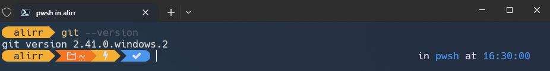
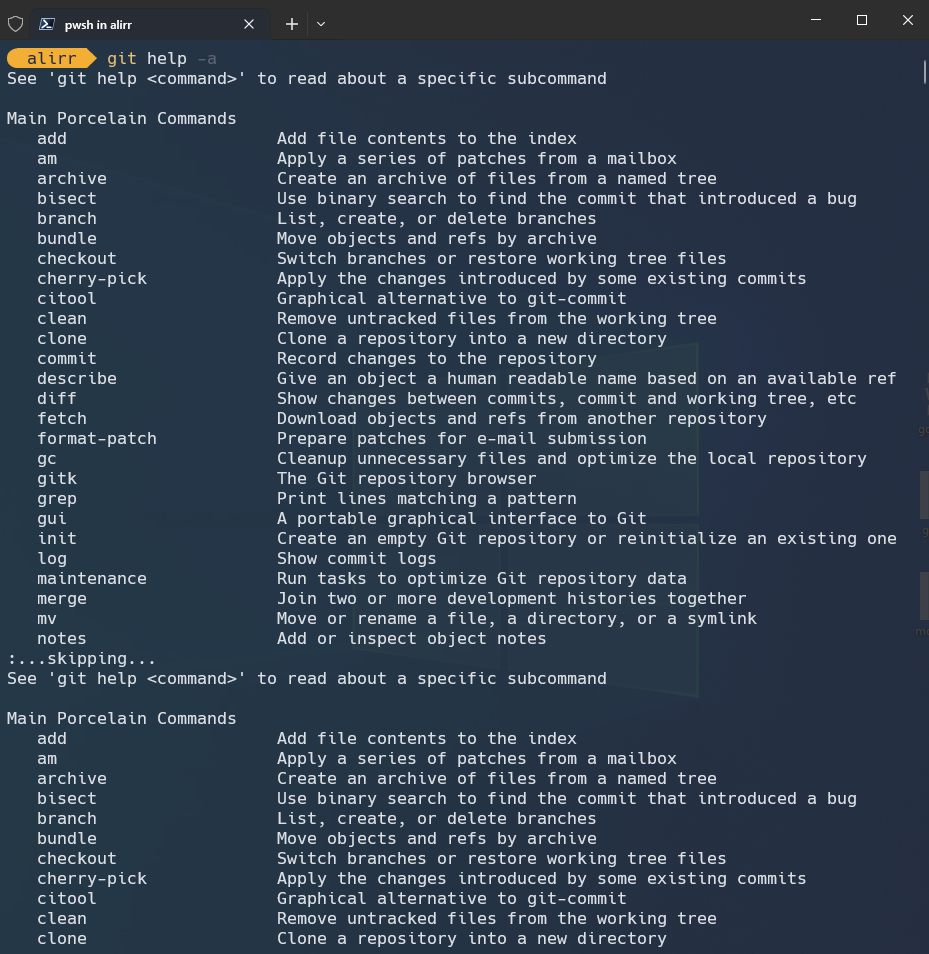
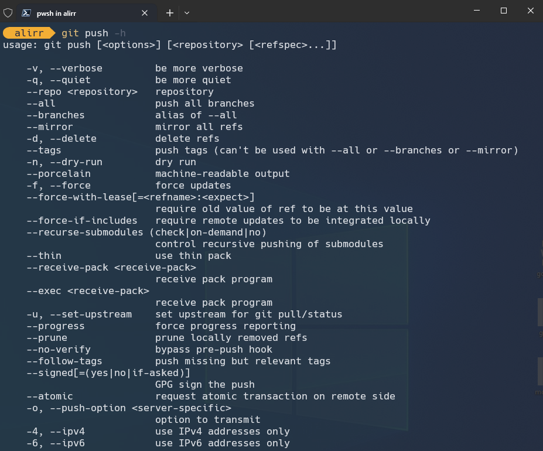

<div dir="rtl" align='justify'>

# Git & Github

## فهرست

* [چرا گیت؟](#چرا-گیت؟)
* [نصب گیت](#نصب-گیت)
* [سینتکس گیت و دستور help](#سینتکس-گیت-و-دستور-help)
* [تنظیمات اولیه](#تنظیمات-اولیه)

## چرا گیت؟


امروزه یکی از ویژگی‌های مهم پیشبرد پروژه‌های کامپیوتری، بهبود مستمر است. بهبود مستمر یعنی افزودن ویژگی‌ها(features) و رفع اشکال‌های(bugs) برنامه در بهبود‌های کوچک به کد اصلی اضافه شود. حال به این فکر کنید که چگونه می‌توانید یک پروژه‌ی کامپیوتری را که تعداد زیادی برنامه‌نویس روی آن کار می‌کنند، مدیریت کنید؟
فرض کنید به همراه دوستتان قصد دارید یک پرو‌ژه‌ی ساده بزنید. ابتدا شما فایل‌های اولیه پروژه را روی سیستم‌تان ایجاد می‌کنید. چگونه می‌خواهید این پروژه را به دوستتان بدهید؟ شاید جواب شما انتقال فایل‌ها از طریق یک فلش باشد! ولی پس از این انتقال، شما روی سیستم خودتان و دوستتان روی سیستم خودش یک نسخه متفاوت از پروژه را پیش می‌برید. به وضوح اشکال‌های زیادی در این نحوه‌ پیشبرد پروژه وجود دارد. نه تنها شما نمی‌توانید از بخش‌هایی که فرد دیگر زده استفاده کنید، بلکه فرآیند به هم چسباندن این دو پروژه کاری بسیار سخت خواهد بود. (مخصوصا اگر روی فایل‌های یکسانی کار کنید)
حال شاید این راه به فکرتان برسد که هرکس روی یک بخش از پروژه کار کند و پس از تمام شدن کارش، کل پروژه روی فلش به فرد دیگر منتقل شود. ولی این کار به شدت سرعت پیشرفت کار را گرفته و معنای کار گروهی را زیر سوال می‌برد!
مشکلات فراوان دیگری در این نوع راه‌حل‌ها وجود دارد. مثلا اگر چند روز پیش چند تغییر در فایل‌های پروژه ایجاد کرده باشید و امروز متوجه شده باشید کار شما اشتباه بوده است، هیچ راه ساده‌ای برای جبران این اشتباه وجود ندارد و باید هر فایل را باز کرده و تغییرات را (اگر یادتان باشد!) برگردانید. بهترین راهی که به فکر می‌رسد آن است که پروژه روی یک سرور قرار بگیرد. بدین ترتیب شما و دوستتان می‌توانید پروژه را کم‌کم پیش ببرید. اما باز هم مشکلات بالا تا حد زیادی وجود دارند و باید به دنبال راه حلی برای کنترل پیشرفت پروژه بود.
برای حل این مشکلات سیستم‌های کنترل نسخه (VCS: Version Control Systems) پدید آمدند. این سیستم‌ها با نگه‌داری نسخه‌هایی از تاریخچه‌ی پروژه، به مدیریت آن کمک می‌کنند. گیت یکی از بهترین سیستم‌های کنترل نسخه است.
در گیت هر کسی روی سیستم خود یک نسخه از پروژه را دارد و یک نسخه هم روی یک سرور راه دور (remote) گذاشته می‌شود. هر کسی تغییرات مورد نظرش را روی سیستم خودش اعمال کرده و در نهایت آن‌ها را روی سرور اعمال می‌کند. همچنین هرگاه نیاز داشته باشد می‌تواند از سرور نسخه‌ی جدید را دریافت کند تا تغییرات دیگران را روی سیستم خودش داشته باشد. گیت در عین سادگی، امکانات و ویژگی‌های بسیار پیشرفته‌ای دارد. تمام مشکلات مطرح شده در بالا و بسیاری نیازمندی‌های دیگر توسط گیت کاملا برطرف می‌شوند.
گیت نسخه‌های مختلفی از پروژه را ایجاد می‌کند. هر نسخه از پروژه را یک کامیت (commit) می‌نامیم. به طور مثال در شکل زیر برنامه در کامیت ۱ دارای اشکال است و در کامیت ۲ این اشکال برطرف شده است. باید بدانیم که کامیت موجودی تغییرناپذیر (immutable) است. یعنی هر نسخه‌ای از پروژه که ایجاد می‌شود به هیچ وجه تغییر نمی‌کند و اگر تغییراتی را روی آن ایجاد کنیم، در واقع نسخه‌ای جدید ایجاد کرده‌ایم.

<p align="center"></p>

حال ممکن است برایتان سوال شود که گیت چگونه عمل می‌کند؟ آیا گیت برای هر نسخه، از تمام فایل‌های پروژه کپی می‌گیرد؟ برای جواب دادن به این سوالات باید بدانیم که گیت به صورت بهینه طراحی شده است. به طور مثال فرض کنید در شکل بالا فقط یک فایل تغییر کرده باشد و در کامیت ۱ تعداد ۱۰۰ فایل داشته باشیم، گیت در کامیت ۲ تعداد ۱۰۱ فایل نگهداری خواهد کرد. نحوه‌ی دقیق کار کردن گیت بسیار پیشرفته است و نیازی به دانستن آن نیست. صرفا باید بتوانیم به صورت حرفه‌ای از امکانات آن استفاده کنیم.

## نصب گیت

حال می‌خواهیم گیت را نصب کنیم. برای این‌کار ابتدا ترمینال (command prompt در ویندوز) را روی سیستم‌تان باز کنید و دستور زیر را بزنید.

``` bash
git --version
```

در صورتی که گیت روی سیستم شما نصب باشد، مانند شکل زیر نسخه نصب شده روی سیستم‌تان نمایش داده خواهد شد.

<p align="center"></p>

### نصب روی مک

برای نصب گیت روی مک به [این سایت](https://sourceforge.net/projects/git-osx-installer/files) رفته و آخرین نسخه موجود را دانلود و نصب کنید. سپس با دستور زیر نسخه گیت نصب شده را دریافت و از نصب بودن آن اطمینان حاصل کنید.

``` bash
git --version
```

### نصب روی لینوکس

ترمینال خود را باز کرده و دستورات زیر را به ترتیب بزنید:

```bash
sudo apt-get update
sudo apt-get install git
```

حال با اجرای دستور زیر نسخه گیت نصب شده را دریافت و از نصب بودن آن اطمینان حاصل کنید.

``` bash
git --version
```

### نصب روی ویندوز

برای نصب گیت روی ویندوز، ابتدا به [این سایت](https://gitforwindows.org/) مراجعه کرده و آخرین نسخه موجود را دانلود و نصب کنید. دقت کنید که در مراحل نصب، گیت تنظیمات زیادی را در اختیار شما قرار می‌دهد ولی شما نیازی به تغییر تنظیمات ندارید. در ویندوز، در کنار گیت، `git bash` نیز نصب خواهد شد که ترمینالی برای استفاده از گیت است. حال با گشتن بین برنامه‌های نصب شده، `git bash` را اجرا کرده و در آن به عنوان نمونه، با دستور زیر نسخه گیت نصب شده را دریافت کنید. از این پس دستورات گیت را در این ترمینال بزنید. دقت کنید این ترمینال دستوراتی مطابق با دستورات لینوکس دارد و با command prompt (یا همان CMD) متفاوت است.
برای اجرای برنامه Git Bash ، ابتدا به آدرس (دایرکتوری) مورد نظرتان رفته و سپس با کلیک راست، بر روی گزینه `Git Bash Here` کلیک کنید تا ترمینال Git Bash برای شما باز شود.
حال با اجرای دستور زیر در Git Bash نسخه گیت نصب شده را دریافت و از نصب بودن آن اطمینان حاصل کنید.

``` bash
git --version
```

## سینتکس گیت و دستور help

ابتدا به معرفی دستور `git help` می‌پردازیم. اگر این دستور را در ترمینال خود بزنید مشاهده می‌کنید که اطلاعات کلی برای گیت نمایش داده می‌شود. این دستور به صورت کلی برای نمایش داکیومنت‌های گیت استفاده می‌شود و هیچ عملیات اجرایی (تغییر فایل‌ها و …) انجام نمی‌دهد. در واقع پروژه‌ی شما قبل و بعد از استفاده از این دستور دقیقا یکسان خواهد بود. در ادامه این درس‌نامه با این دستور بیشتر آشنا خواهید شد.

<p align="center"></p>

حال به صورت خلاصه سینتکس دستورات گیت را معرفی می‌کنیم. تمام دستورات گیت به شکل زیر نوشته می‌شوند:

```bash
git [COMMAND] [FLAGS] [ARGUMENTS]
```

که در آن هر کدام از موارد داخل کروشه، اختیاری هستند. به طور مثال در دستور `git help` که در بالا زدید، `[COMMAND]` برابر با `help` بود.

حال هر بخش را معرفی می‌کنیم.

1. بخش COMMAND

این قسمت دستوری است که به گیت داده می‌شود. گیت در هر مرحله تنها یک دستور را اجرا می‌کند. به طور مثال در شکل بالا دستور `git help` اطلاعات کلی برای گیت را نمایش می‌دهد.

2. بخش FLAGS

در این قسمت صفر یا تعدادی پرچم (flag) گذاشته می‌شود. پرچم‌ها گاهی با یک خط تیره و گاهی با دو خط تیره نمایش داده می‌شوند. پرچم‌ها دستور کلی را تغییر نمی‌دهند و به کمک آن‌ها از حالات مختلف یک دستور می‌توانیم بهره ببریم. به طور مثال در شکل زیر، دستور `git help -a` تمام commandهای موجود در گیت را نمایش می‌دهد.

<p align="center"></p>

حال اگر دستور `git help --all` را بزنید، خروجی آن دقیقا مشابه تصویر بالا خواهد بود.

3. بخش ARGUMENTS

در این بخش صفر یا تعدادی آرگومان برای command نوشته می‌شود. این آرگومان‌ها ورودی‌های مورد نیاز برای command هستند. به طور مثال در شکل زیر، دستور `git help push` توضیحات مربوط به دستور push را نمایش می‌دهد.

<p align="center"></p>

همچنین می‌توانید مطابق شکل زیر، به جای استفاده از دستور بالا، با یک پرچم -h از طریق خود دستور push اطلاعات کلی مربوط به آن دستور را دریافت کنید.

```bash
git push -h
```

<p align="center"></p>

## تنظیمات اولیه

در این بخش می‌خواهیم تنظیمات اولیه مورد نیازتان برای گیت را انجام دهیم.
ابتدا باید نام کاربری و ایمیل‌تان را به تنظیمات گیت اضافه کنید. این مورد برای کار تیمی مهم است چرا که هنگام کار با سرور باید با نام و ایمیل‌تان شناخته شوید. برای این کار از دستور زیر استفاده می‌کنیم:

```bash
git config --global <key> [<value>]
```

با استفاده از پرچم `--global` تنظیمات برای تمام پروژه‌های کاربر فعلی سیستم (User ای که با آن وارد سیستم‌عامل شده‌اید) اعمال خواهد شد.
عبارت `<key>` نام تنظیمات مورد نظر (برای مثال نام یا ایمیل) و `[<value>]` مقدار مورد نظر است.
شما در این مرحله باید تنظیمات خود را مطابق دستورات زیر انجام دهید. نام دلخواه و ایمیل مورد نظر خودتان را وارد کنید.

```bash
git config --global user.name "sample_name"
git config --global user.email "sample_email@sample.com"
git config --global core.editor "nano"
```

خط آخر دستورات بالا ویرایشگر nano را به عنوان ویرایشگر پیشفرض گیت برای شما تنظیم می‌کند. در ادامه‌ی دوره با ویرایشگر nano آشنا خواهید شد. حال برای آن‌که مشاهده کنیم چه تنظیماتی بر روی سیستم ما قرار دارد، می‌توانیم از دستور زیر استفاده کنیم.

```bash
git config --list
```

این دستور تمام تنظیمات موجود را نمایش می‌دهد. شما با وارد کردن این دستور، می‌توانید تنظیماتی را که در این درس‌نامه وارد کرده‌اید، مشاهده کنید.

## راه‌اندازی کلید SSH

شما نیازی به دانستن نحوه‌ی دقیق اجرای SSH ندارید و صرفا مراحل زیر را انجام دهید:

1. ترمینال (یا git bash در ویندوز) را باز کنید.
2. دستور `ssh-keygen` را بزنید و سپس ۳ بار enter بزنید تا تنظیمات پیش‌فرض استفاده شود. شکل کلی به صورت زیر خواهد بود:

<p align="center"></p>

3. دستور زیر را بزنید.

```bash
eval `ssh-agent`
```

3. با توجه به سیستم‌عامل‌تان یکی از دستورات زیر را بزنید.

### مک

```bash
ssh-add -K ~/.ssh/id_rsa
```

سپس در صورت وجود، وارد فایل ~/.ssh/config شده و دو خط زیر را به این فایل اضافه کنید:

```
Host *
UseKeychain yes
```

اگر فایل بالا برای‌تان وجود نداشت، مشکلی وجود ندارد و می‌توانید به ادامه درس بپردازید.

### لینوکس

```bash
ssh-add ~/.ssh/id_rsa
```

### ویندوز

```bash
ssh-add ~/.ssh/id_rsa
```

با انجام این مراحل این کلید در سیستم شما تنظیم شده است. حال باید کلید عمومی را در سروری که از آن استفاده می‌کنید تنظیم کنید.

## آموزش مقدماتی ترمینال

در سیستم عامل لینوکس، ترمینال ابزاری برای ارتباط با هسته سیستم‌عامل است که از طریق تایپ کردن دستورات می‌توان آن‌ها را اجرا کرد. برخی از دستورات را می‌توان به سادگی و به سرعت، به وسیله‌ی وارد کردن یک دستور (command) اجرا کرد. در این درس‌نامه دستورات مقدماتی برای کار با ترمینال را آموزش می‌دهیم.

در ابتدا برای باز کردن ترمینال با توجه به سیستم‌عامل‌تان به صورت زیر عمل کنید:

### لینوکس

در این سیستم عامل‌ می‌توان از طریق سرچ terminal در بخش Applications یا از طریق فشردن دکمه‌های T + alt + ctrl یک پنجره ترمینال باز کرد.

### مک

ابتدا command + space را فشرده و عبارت terminal را سرچ کنید. سپس اینتر را فشار دهید تا ترمینال باز شود.

### ویندوز

در ویندوز به جای ترمینال از Git Bash که به همراه گیت نصب شده است استفاده می‌کنیم. عبارت Git Bash را در بخش سرچ تولبار (پایین صفحه) تایپ کرده و اینتر را فشار دهید.

حال در پنجره باز شده می‌توان دستورات مورد نظر خود را تایپ کرد که در ادامه به معرفی برخی از آن‌ها می‌پردازیم.

### دستور pwd (print working directory):

این دستور، آدرس کامل دایرکتوری (یا فولدر) فعلی را به ما نشان می‌دهد. در واقع نشان می‌دهد که دستوراتی که اجرا می‌کنیم در کدام دایرکتوری اجرا می‌شوند.

<p align="center"></p>

### دستور cd (change directory):

با استفاده از این دستور می‌توان دایرکتوری فعلی را تغییر داد. به این صورت که پس از دستور cd آدرس دایرکتوری جدید را می‌نویسیم.

آدرس می‌تواند مطلق مانند دستور زیر باشد (یعنی آدرس کامل دایرکتوری مقصد مستقل از دایرکتوری فعلی نوشته شود):

```bash
cd /home/test
```
 
یا به صورت نسبی با توجه به دایرکتوری فعلی نوشته شود (فرض کنید دایرکتوری فعلی دارای یک دایرکتوری به نام test باشد.):

```bash
cd test
```

کمی پایین‌تر مثالی دیگر از آدرس مطلق و آدرس نسبی می‌آوریم تا فرق این دو واضح‌تر شود.

<p align="center"></p>

 
در آدرس دهی می‌توان از .. به عنوان دایرکتوری پدر (دایرکتوری‌ای که شامل دایرکتوری فعلی است) و از ~ به عنوان home استفاده کرد. برای رفتن به Desktop هم می‌توان از دستور زیر استفاده کرد.

```bash
cd ~/Desktop
```
 
حال فرض کنید دایرکتوری فعلی‌مان Desktop باشد و بخواهیم وارد دایرکتوری‌ای به نام dir که در همین Desktop وجود دارد شویم. می‌توانیم به یکی از دو روش زیر این کار را انجام دهیم:

```bash
cd ~/Desktop/dir
```

```bash
cd dir
```

دستور اول از آدرس‌دهی مطلق و دستور دوم از آدرس‌دهی نسبی استفاده می‌کند. دقت کنید که اگر در زمان اجرای این دستور، دایرکتوری فعلی‌مان Desktop نبود دستور دوم با مشکل مواجه می‌شد، اما همچنان دستور اول به درستی کار می‌کرد.

### دستور ls (list):

این دستور محتویات دایرکتوری فعلی را نمایش می‌دهد. اگر آدرس دایرکتوری دیگری را پس از ls تایپ کنیم، محتویات آن دایرکتوری را به ما نمایش می‌دهد.

<p align="center"></p>


دستور زیر همه فایل‌های دایرکتوری شامل فایل‌های مخفی (فایل‌هایی که نامشان با . شروع می‌شود) را نمایش می‌دهد.

```bash
ls -a
```
 
### دستور mkdir (make directory):

این دستور داخل دایرکتوری فعلی یک دایرکتوری دیگر به اسم گرفته شده می‌سازد. به طور مثال، دستور زیر یک دایرکتوری به اسم test می‌سازد.

```bash
mkdir test
```

در تصویر زیر به Desktop می‌رویم و پوشه‌ای جدید به نام alireza می‌سازیم.

<p align="center"></p>


### دستور touch:

این دستور یک فایل جدید و خالی به اسم داده شده می‌سازد.

<p align="center"></p>

 
### دستور cp (copy):

این دستور آدرس یک فایل و یک آدرس دیگر می‌گیرد و فایل اول را در جای آدرس دوم کپی می‌کند. برای مثال دستور :

```bash
cp file1 test/file2
```

از file1 که در فولدر فعلی وجود دارد در فولدر test یک کپی به نام file2 می‌سازد.

یا به طور مثال دستور :

```bash
cp test1/file1 test2/file2
```

از فایل file1 در فولدر test1 یک کپی به نام file2 در test2 می‌سازد.

از این دستور، برای کپی کردن فولدرها نیز استفاده می‌شود. با این تفاوت که اگر می‌خواهید فولدر را به همراه محتویاتش کپی کنید؛ باید از فلگ -r استفاده کنید. برای مثال، دستور :

```bash
cp -r dir1 test1/dir2
```

از فولدر dir1 ، یک کپی به نام dir2 در فولدر test1 می‌سازد.


### دستور mv (move):

این دستور همانند دستور cp است اما به جای کپی کردن، خود فایل را منتقل می‌کند (کات و پیست). به عنوان مثال هر کدام از دو دستور زیر فایل file از فولدر dir1 را به فولدر dir2 منتقل می‌کنند.

```bash
mv dir1/file dir2/file
```

```bash
mv dir1/file dir2/
```

همچنین برای تغییر نام یک فایل یا فولدر هم از این دستور استفاده می‌شود و در آدرس دوم برای اسم فایل، اسم جدید را قرار می‌دهیم. به طور مثال دستور زیر نام file1 را به file2 تغییر می‌دهد.

```bash
mv file1 file2
```

### دستور rm (remove):

از این دستور برای حذف فایل‌ها و فولدرها استفاده می‌شود. برای حذف فولدرهایی که خالی نیستند به همراه محتویاتشان می‌توان از دستور rm -rf استفاده کرد. به طور مثال دستور زیر فولدر test و همه فایل‌های داخلش را حذف می‌کند.

```bash
rm -rf test
```

### ویرایش فایل متنی با nano:

همان‌طور که انتظار می‌رود، ترمینال ابزارهای متعددی برای ویرایش فایل‌ها دارد. دو مورد از معروف‌ترین این ابزارها vim و nano هستند. ما در اینجا کار کردن اولیه با nano را آموزش می‌دهیم. برای شروع ویرایش یک فایل با نام test، از دستور زیر استفاده می‌کنیم:

```bash
nano test
```

لازم به ذکر است که اگر فایلی با این نام وجود نداشته باشد، nano برایمان یک فایل خالی می‌سازد.

با اجرای دستور بالا وارد محیط nano می‌شویم که شبیه تصویر زیر است.

<p align="center"></p>
 
در این محیط می‌توانیم به صورت عادی هر چیزی در فایل بنویسیم (مثل تصویر زیر).

<p align="center"></p>

 
به پایین تصویر بالا دقت کنید. nano همواره در پایین ترمینال دستوراتی که می‌توانیم وارد کنیم را می‌نویسد. به عنوان مثال مشاهده می‌کنیم که ترکیب O + ctrl برای دستور WriteOut گفته شده است که در واقع به معنی ذخیره تغییرات فایل است. O + ctrl را با هم فشار دهید تا فایل ذخیره شود. مطابق تصویر زیر مشاهده می‌کنیم که nano از ما برای ذخیره کردن، نام یک فایل می‌خواهد که به صورت پیش‌فرض همان test است.

<p align="center"></p>

 
با فشردن enter همین نام را تایید می‌کنیم تا فایل‌مان ذخیره شود. حال که فایل‌مان ذخیره شده است، بیایید با هم از محیط nano خارج شویم. مشاهده می‌کنیم که در زیر صفحه برای Exit ترکیب X + ctrl نوشته شده است. با فشردن این ترکیب از محیط nano به محیط ترمینال برمی‌گردیم. نکته آخر حائز اهمیت این است که اگر بدون این که فایل را ذخیره کنیم سعی کنیم از nano خارج شویم، nano مشابه تصویر زیر از ما می‌پرسد که آیا می‌خواهیم قبل خارج شدن، فایل را برایمان ذخیره کند یا خیر.

<p align="center"></p>


که باز هم در پایین ترمینال می‌بینیم که می‌توانیم با Y و N (به معنی Yes و No) به این سوال پاسخ دهیم یا با C + ctrl به محیط nano برگردیم.

</div>